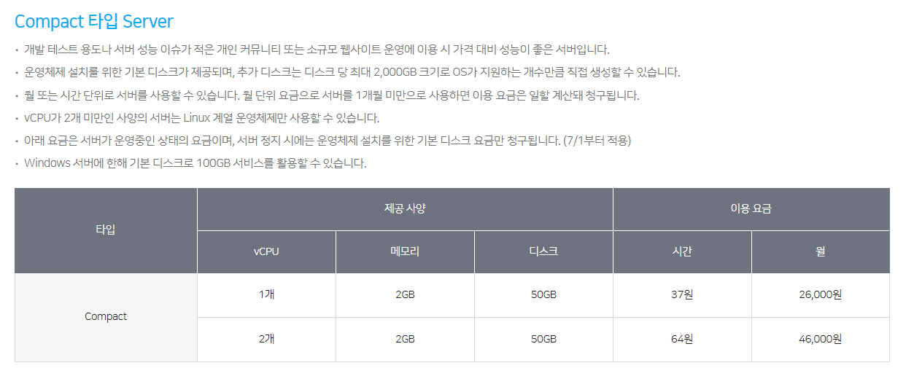

## TOC

- [TOC](#toc)
- [FTP 서버를 옮기기](#ftp-%EC%84%9C%EB%B2%84%EB%A5%BC-%EC%98%AE%EA%B8%B0%EA%B8%B0)
- [웹호스팅 종류](#%EC%9B%B9%ED%98%B8%EC%8A%A4%ED%8C%85-%EC%A2%85%EB%A5%98)
    - [블루웹호스팅](#%EB%B8%94%EB%A3%A8%EC%9B%B9%ED%98%B8%EC%8A%A4%ED%8C%85)
    - [가비아 웹호스팅](#%EA%B0%80%EB%B9%84%EC%95%84-%EC%9B%B9%ED%98%B8%EC%8A%A4%ED%8C%85)
    - [카페24](#%EC%B9%B4%ED%8E%9824)
    - [고도호스팅](#%EA%B3%A0%EB%8F%84%ED%98%B8%EC%8A%A4%ED%8C%85)
    - [웹호스팅 결론 : 실패 사용하지 못함](#%EC%9B%B9%ED%98%B8%EC%8A%A4%ED%8C%85-%EA%B2%B0%EB%A1%A0-%EC%8B%A4%ED%8C%A8-%EC%82%AC%EC%9A%A9%ED%95%98%EC%A7%80-%EB%AA%BB%ED%95%A8)
- [가상서버 호스팅종류](#%EA%B0%80%EC%83%81%EC%84%9C%EB%B2%84-%ED%98%B8%EC%8A%A4%ED%8C%85%EC%A2%85%EB%A5%98)
    - [카페24](#%EC%B9%B4%ED%8E%9824)
    - [N클라우드](#n%ED%81%B4%EB%9D%BC%EC%9A%B0%EB%93%9C)
    - [고도호스팅](#%EA%B3%A0%EB%8F%84%ED%98%B8%EC%8A%A4%ED%8C%85)
    - [스팅어 호스팅](#%EC%8A%A4%ED%8C%85%EC%96%B4-%ED%98%B8%EC%8A%A4%ED%8C%85)

## FTP 서버를 옮기기

FTP 지원가능한 웹서버 호스팅 자료조사

## 웹호스팅 종류

### 블루웹호스팅

* url : http://www.blueweb.co.kr/hostings/webhosting/w_linux_cost.html

### 가비아 웹호스팅

* url : https://webhosting.gabia.com/service

### 카페24

* url : https://www.cafe24.com/?controller=product_page&type=basic&page=autoban

### 고도호스팅

* url : http://hosting.godo.co.kr/webhosting/webhosting_service_info.php

### 웹호스팅 결론 : 실패 사용하지 못함

웹호스팅은 FTP 제공하는것을 실제 사용하기위한 목적이 아니다. 관리용이다.
때문에, FTP 사용에 대해서 동시접속제한등이 있다. -> 사용하지 못함

**`가상화 호스팅이나 단독호스팅 필요`**

## 가상서버 호스팅종류

### 카페24

* url : https://www.cafe24.com/?controller=product_page&type=server&page=virtual_linux

### N클라우드

* url : https://www.ncloud.com/product/compute/server

### 고도호스팅

* url : https://cloudweb.godo.co.kr/

### 스팅어 호스팅

* url : https://www.hostinger.kr/cloud-hosting

